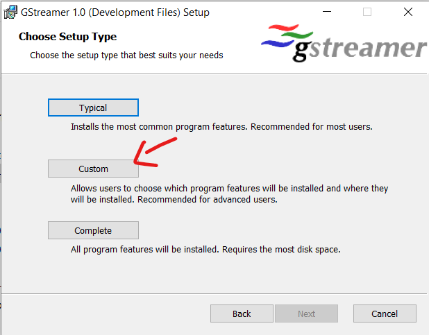
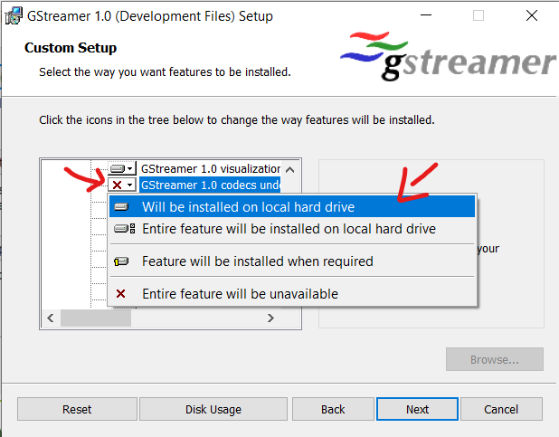

*Copyright (c) 2025 ONVIF. All rights reserved.*

### Environment variables

To build this solution, you need:
- OpenSSL 3.3.1 x64 or higher (https://slproweb.com/products/Win32OpenSSL.html)
- GStreamer x64 dev version (https://gstreamer.freedesktop.org/download/#windows)
  *Note: Select all packages to install during GStreamer installing, see the screenshots below*
  Select **Custom** installation: 
  
  Repeat for **all** items with the red x:
  
  

Also, you should add two Environment variables to tell where those components are installed: 
- OPENSSL_PATH
- GSTREAMER

As example:
- OPENSSL_PATH = C:\Program Files\OpenSSL-Win64
- GSTREAMER = C:\gstreamer\1.0\msvc_x86_64

*Note: After successfully compilation you can find executables in VS2022\x64\Debug or Release (in depends of buld type)*

To run the validator, you additionally need:
- GStreamer x64 runtime version (https://gstreamer.freedesktop.org/download/#windows)
  *Note: Do full install like GStreamer dev in the steps above*

Also, you should add path to OpenSSL binaries and path to GStreamer binaries to the Path Environment variable, as example:
- C:\Program Files\OpenSSL-Win64\bin
- C:\gstreamer\1.0\msvc_x86_64\bin

*Note: After Environment variables edit the Visual Studio should be restarted to load the changes*

Otherwise, please update project properties yourself, depending on used libraries and paths.