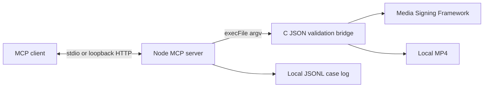
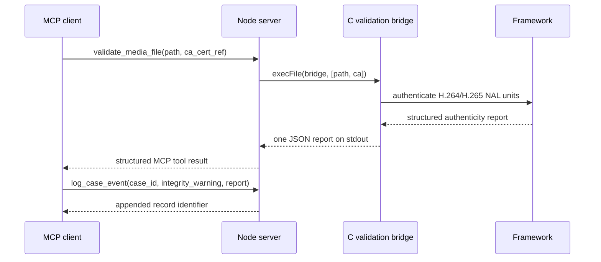

# Explanation: Architecture and Trust Boundaries

The demo makes the framework's cryptographic validation result available to an
MCP client. It does not make an independent forensic or legal determination.

The Node server never parses media. It validates tool inputs, starts the native
validation bridge as a child process, and returns its JSON report. The bridge is
small but necessary: the existing validator example produces a report intended
for people, while MCP needs stable structured output. The bridge uses GStreamer
to identify the video codec, feeds encoded NAL units into the Media Signing
Framework, and serializes the framework's final structured report as one JSON
object. It does not implement independent authenticity rules.

## Result Semantics

`authentic` means the framework validated the signed media. An
`integrity_warning` means media validation succeeded subject to missing
validation information or NAL units. Signing-key provenance is a separate field
and may be `not_trusted` even when the media is authentic, for example when the
stream omits the certificate chain needed to reach the configured CA. The demo
preserves the framework's combined result as a numeric field. A failed result is
not equivalent to proving a cryptographic forgery.

## Transport Modes

In stdio mode, the MCP client launches the server and owns its input/output
pipes. This is the primary integration mode for Copilot and other MCP hosts. The
bundled `demo:stdio` command uses the same lifecycle, so the server is not a
separately attachable process.

Loopback HTTP mode exists to make that boundary visible in a demonstration. A
long-running server listens on `127.0.0.1`, and `demo:http` connects from a
second terminal. It has no authentication and is not intended for remote or
multi-user deployment.

Both modes invoke the same tools and native bridge. Subprocess separation
improves failure isolation, but it is not a formal sandbox. See
[future work](future-work.md) for hardening and production concerns.
